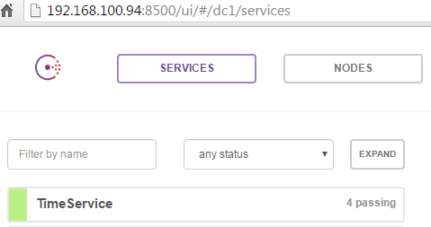
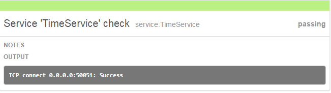

# TimeService

提供单一时间源的时间服务

集群内或分布式系统中，时间可能有不同步的问题（时间值不能准确表示时间先后顺序）

单一时间源即可解决此问题

本时间服务使所有的时间值获取都使用（服务端）单一时间源，而不是各个客户端的系统时间

保证集群内或分布式系统中服务调用时间顺序和得到的时间值顺序一致

## 运行

```
cd bin
./timeServer
```

## 服务访问
可采用grpc支持的任一语言编写
以下通过go语言实现的客户端进行示例

```
cd bin
./timeClient
```

## 示例输出
```
# ./timeClient 
Time is: 2016-05-05 14:14:45.241
# 
```

## Usage

### Server

```
$ ./timeServer -h
Usage of ./timeServer:
  -addr string
        addr to listen(default to all interface) (default "0.0.0.0")
  -author
        Show author.
  -consuladdr string
        registry addr(default to localhost)
  -consulport string
        registry addr(default to 8500)
  -port string
        port to listen (default "50051")
  -v    Show version.
```

### Client

```
$ ./timeClient -h
Usage of ./timeClient:
  -addr string
        addr to connect(default is localhost)
  -author
        Show author.
  -port string
        port to connect
  -v    Show version.
```

## Service registering and discovery

It now support consul service register ( from server ) and discovery ( from client )

### New service



### Service check



更多信息可参考源代码
